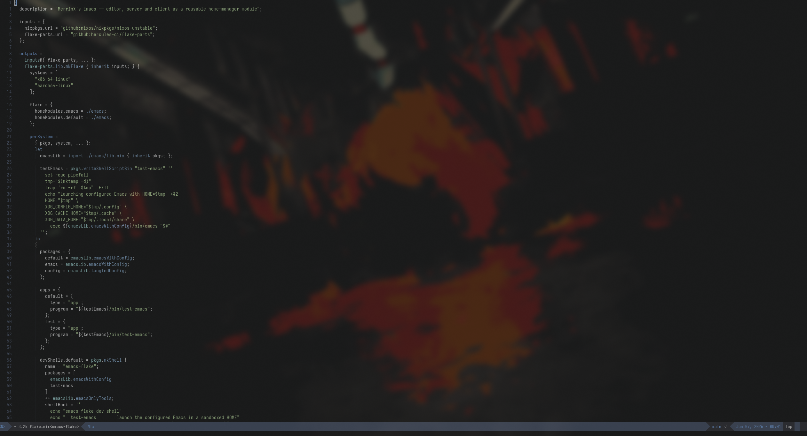

#+TITLE: emacs-flake
#+AUTHOR: MerrinX
#+OPTIONS: toc:2 num:nil

MerrinX's Emacs packaged as a reusable [[https://flake.parts/][flake-parts]] flake. It exposes the
Emacs *editor*, the Emacs *server* (a socket-activated systemd user
daemon) and the Emacs *client* (~emacsclient~ wrapper) as a single
home-manager module, plus dev/test outputs so you can verify the
configuration builds before rolling it out.

#+CAPTION: Emacs Configuration

* What's inside

| Path                  | Purpose                                                                |
|-----------------------+------------------------------------------------------------------------|
| ~flake.nix~           | flake-parts entrypoint; outputs, dev shell, checks and apps            |
| ~emacs/default.nix~   | the reusable home-manager module (~programs.merrinx-emacs~)            |
| ~emacs/lib.nix~       | single source of truth: package set, tools, custom builds, assembly   |
| ~emacs/modules/~      | the Emacs configuration as a tree of small Nix modules (inline elisp) |

The configuration lives as a tree of small Nix modules under
~emacs/modules/~. Each module is a function returning an attribute set with
an ~order~ (its position in the emitted elisp) and an ~elisp~ string:

#+begin_src nix
  { pkgs, lib, ... }:
  {
    order = 1205;
    elisp = ''
      (use-package kotlin-ts-mode
        :mode "\\.kt\\'")
    '';
  }
#+end_src

At build time every ~*.nix~ module is imported, sorted by ~order~ and its
~elisp~ concatenated into a single ~config.el~. That file is then *native +
byte compiled* into an Emacs package (~merrinx-config~) so nothing is
interpreted or JIT-compiled on startup — speed is the priority. The
compiled configuration is loaded from the Nix store via
~(require 'merrinx-config)~. There are no hardcoded paths and nothing is
written into the store at runtime, so the configuration is fully
self-contained and reproducible. Modules that need store paths (e.g.
typescript / vue tooling) interpolate them directly in their elisp.

* Flake outputs

#+begin_src text
homeModules.emacs            # the reusable home-manager module (import this)
homeModules.default          # alias of the above

packages.<system>.emacs          # the fully configured Emacs (binary + config)
packages.<system>.default        # alias of the above
packages.<system>.config         # the assembled config.el (for inspection)
packages.<system>.config-compiled # the native + byte compiled config package

apps.<system>.default        # `nix run` — launch Emacs in a sandboxed HOME
apps.<system>.test           # same as default

devShells.<system>.default   # configured Emacs + all external tools on PATH

checks.<system>.emacs            # builds everything (packages + custom builds)
checks.<system>.config-compiles  # native + byte compiles the assembled config
#+end_src

* Testing it in a dev environment

Verify everything builds and the config compiles cleanly:

#+begin_src sh
  nix flake check
#+end_src

Launch the configured Emacs in a throwaway ~$HOME~ (never touches your real
~~/.emacs.d~ or state) so you can interactively confirm it works:

#+begin_src sh
  nix run .
#+end_src

Drop into a shell with the configured Emacs plus every external tool
(LSP servers, formatters, ~eca~, ~gh~, …) on ~PATH~:

#+begin_src sh
  nix develop
  test-emacs        # sandboxed launcher
  emacs             # uses your real HOME
#+end_src

Just build the binary:

#+begin_src sh
  nix build .#emacs
  ./result/bin/emacs --version
#+end_src

* Using it in your dotfiles

** 1. Add the flake as an input

In your dotfiles' ~flake.nix~ inputs:

#+begin_src nix
  emacs-flake = {
    url = "github:Gako358/emacs-flake";
    inputs.nixpkgs.follows = "nixpkgs";
  };
#+end_src

** 2. Import the home-manager module and enable it

This repo's dendritic (flake-parts + ~import-tree~) layout registers the
module under ~flake.homeModules.programs-emacs~ from a tiny wrapper module,
keeping host-specific bits (gating, secrets) in the dotfiles:

#+begin_src nix
  # modules/programs/emacs/default.nix
  { inputs, ... }:
  {
    flake.homeModules.programs-emacs =
      { lib, config, osConfig, ... }:
      let
        inherit (osConfig.environment) desktop;
      in
      {
        imports = [ inputs.emacs-flake.homeModules.emacs ];

        config = lib.mkIf (desktop.enable && desktop.develop) {
          programs.merrinx-emacs.enable = true;

          # Host-specific: authinfo for forge/PR access via sops.
          sops = lib.mkIf osConfig.service.sops.enable {
            secrets = {
              "forge_auth" = { };
              "pr_auth" = { };
            };
            templates."authinfo" = {
              path = "${config.home.homeDirectory}/.authinfo";
              content = ''
                ${config.sops.placeholder."forge_auth"}
                ${config.sops.placeholder."pr_auth"}
              '';
            };
          };
        };
      };
  }
#+end_src

If you don't use the dendritic layout, just add
~inputs.emacs-flake.homeModules.emacs~ to your home-manager ~imports~ and set
~programs.merrinx-emacs.enable = true;~ directly.

* Module options

All options live under ~programs.merrinx-emacs~:

| Option          | Type    | Default     | Description                                              |
|-----------------+---------+-------------+----------------------------------------------------------|
| ~enable~        | bool    | ~false~     | Enable the Emacs editor, server and client.              |
| ~package~       | package | ~emacs30~   | Base Emacs package to build the configuration on.        |
| ~defaultEditor~ | bool    | ~true~      | Set the Emacs client as ~$EDITOR~.                       |
| ~persistence~   | bool    | ~true~      | Register impermanence dirs (ECA cache, Copilot config).  |

When enabled the module configures:

- ~programs.emacs~ — the editor with the full package set and config,
- ~services.emacs~ — socket-activated daemon with client integration,
- ~systemd.user.services.emacs~ — daemon ~PATH~ carrying all language tooling,
- an ~ec~ wrapper around ~emacsclient~ that prepends that same ~PATH~.

* Updating the configuration

Edit (or add) a module under ~emacs/modules/~. A new module is picked up
automatically — just create a ~*.nix~ file returning ~{ order; elisp; }~
(remember to ~git add~ it so the flake sees it). Run ~nix flake check~ to
make sure the whole configuration still native + byte compiles, then bump
the input in your dotfiles (~nix flake update emacs-flake~) and rebuild.
